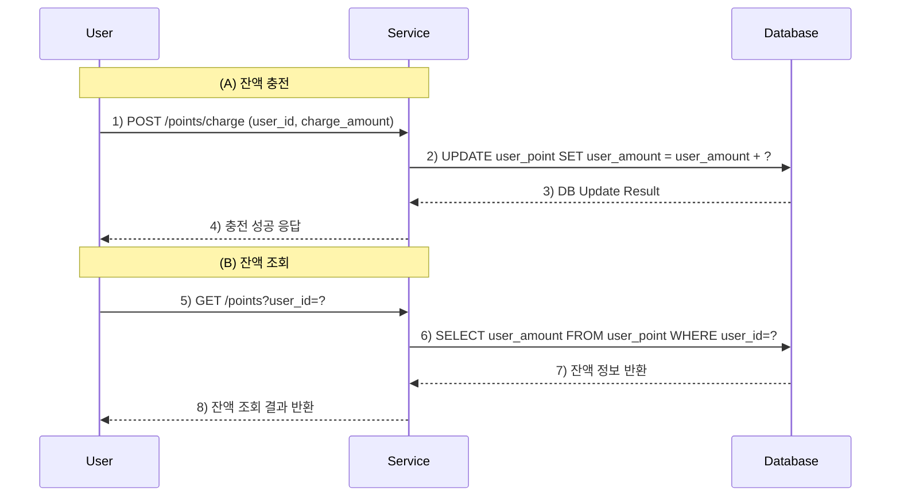
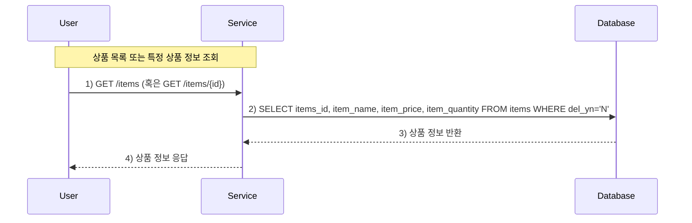
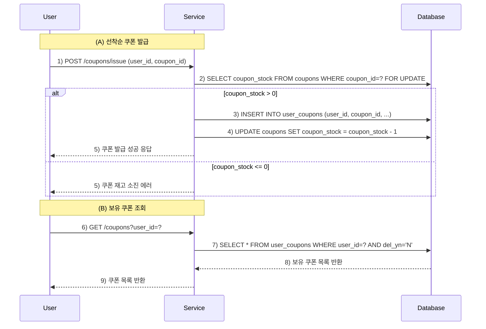
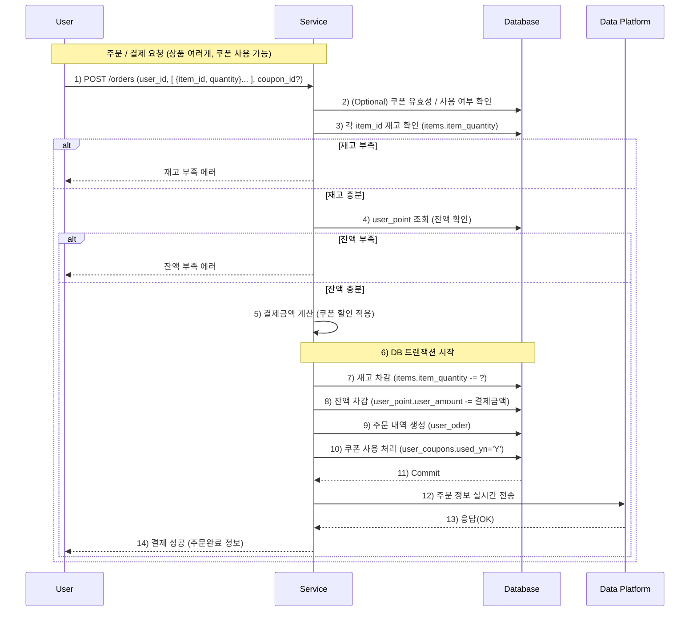
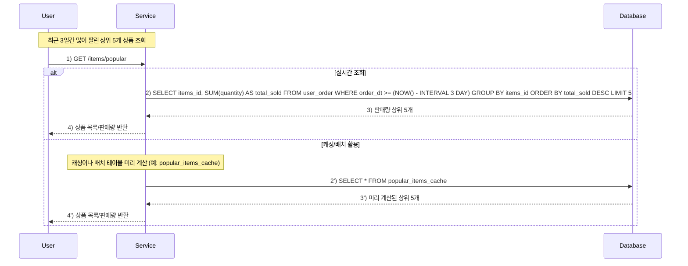
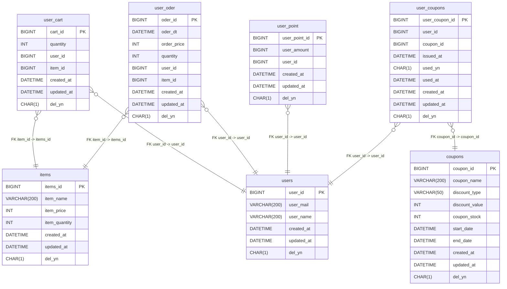

# 1️⃣ 잔액 충전 / 조회 API

## 설명
- (A) 잔액 충전 : 사용자로부터 충전할 금액을 받아 DB의 user_point.user_amount를 업데이트합니다.
- (B) 잔액 조회 : user_id로 현재 잔액을 조회하여 반환합니다.

---

# 2️⃣ 상품 조회 API

## 설명
- 상품 정보 조회 : DB에서 del_yn='N'인 상품들(또는 특정 items_id)을 조회해 상품명, 가격, 재고 등을 반환합니다.
- 조회 시점의 정확한 재고(item_quantity)가 중요합니다.

---

# 3️⃣ 선착순 쿠폰 발급 API & 보유 쿠폰 목록 조회 API

## 설명
- (A) 선착순 쿠폰 발급 :
  coupons.coupon_stock를 확인해 발급 가능하면 user_coupons에 발급 기록을 남기고, coupon_stock를 차감합니다.
  동시성 이슈를 막기 위해 DB에서 FOR UPDATE나 락을 사용할 수 있습니다.
- (B) 보유 쿠폰 조회 : user_coupons에서 해당 유저가 가진 쿠폰 목록을 조회합니다.

---

# 4️⃣ 주문 / 결제 API

## 설명
1. 사용자가 주문/결제 요청 시, (상품 목록, 수량, 쿠폰 ID 등)을 전달합니다.
2. 서버는 쿠폰 상태(used_yn, 재고 등)를 확인하고, 상품 재고(items)와 사용자 잔액(user_point)을 확인합니다.
3. 재고와 잔액이 충분하면, 트랜잭션 내에서
- 재고 차감
- 잔액 차감
- 주문 내역(user_oder) 생성
- 쿠폰 사용 여부(user_coupons) 갱신을 처리합니다.
4. 결제 성공 시, **데이터 플랫폼(DP)**에 주문 정보를 전송합니다. (Mock API, 이벤트, 메시지큐 등 다양)

---
# 5️⃣ 상위 상품 조회 API (최근 3일간 판매량 상위 5개)

## 설명
- 실시간 조회 :
  user_oder 테이블에서 최근 3일간의 판매 데이터를 바로 집계하여 가장 많이 팔린 TOP 5를 추출합니다.
- 캐싱 / 배치 방식 :
  일정 간격으로 배치 작업 등으로 미리 집계 테이블(popular_items_cache)을 만들어두고,
  조회 시 이 테이블에서 빠르게 결과를 반환합니다.

